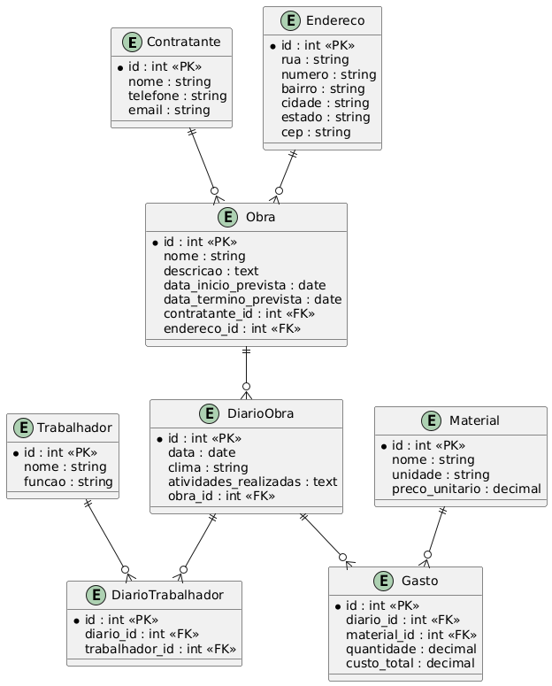
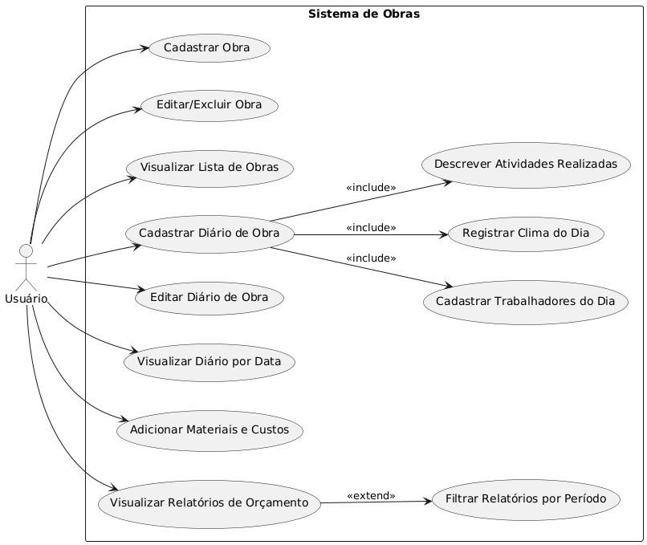

# Projeto ltd 2025.1

## Sistema de Cadastro e Acompanhamento de Obras

O Sistema de Cadastro e Acompanhamento de Obras tem como objetivo fornecer uma solução completa para a gestão de obras de construção civil. Desenvolvido utilizando Python e Django, o sistema permitirá que empresas de construção, engenheiros e gestores acompanhem todas as fases de uma obra de forma eficiente, desde o cadastro até o controle de custos e progressos diários. A proposta é integrar funcionalidades como o registro de dados de obras, acompanhamento diário de atividades, controle de materiais e custos, além de fornecer relatórios financeiros detalhados, tudo em uma interface acessível e intuitiva.

O sistema é dividido em módulos interdependentes que facilitam a organização das informações, permitindo um gerenciamento mais eficaz, ágil e detalhado. Através dele, os usuários poderão monitorar o progresso das obras, registrar as atividades diárias, controlar gastos e otimizar a execução das tarefas de construção.

## Módulos do Sistema

### 1. Cadastro de Obras
Neste módulo, o usuário poderá cadastrar as informações principais de cada obra, como:

- Nome da obra
- Contratante (nome e informações de contato)
- Endereço completo
- Previsão de início e término da obra
- Uma descrição opcional da obra

Esses dados servirão como base para vincular os registros do diário de obra e orçamento.

### 2. Diário de Obra
Permite o acompanhamento diário da execução da obra. Para cada data, o responsável poderá registrar:

- O clima do dia (ensolarado, chuvoso etc.)
- A lista de trabalhadores presentes
- As atividades realizadas e o progresso feito no dia

Esse diário funcionará como um histórico da obra, útil para controle, fiscalização e comprovação do trabalho realizado.

### 3. Orçamento e Custos
Neste módulo, o usuário poderá registrar os materiais comprados e utilizados, associando os gastos ao diário da obra. O sistema permitirá:

- Visualizar gastos diários, semanais e mensais
- Acompanhar a evolução dos custos em relação ao planejamento
- Emitir relatórios financeiros da obra

A divisão dos custos será organizada por data e também por categoria de trabalho (ex: fundação, alvenaria, acabamento).

## Funcionalidades Extras (Opcional)

- Cadastro de usuários com níveis de acesso
- Upload de fotos e documentos
- Dashboard com gráficos e resumos
- Exportação de relatórios em PDF ou Excel

## Diagrama Entidade-Relacionamento

## Explicação do Diagrama de Entidade-Relacionamento

O diagrama apresentado é um **Diagrama de Entidade-Relacionamento (ER)** para o sistema de cadastro e acompanhamento de obras. Ele descreve as entidades principais e seus relacionamentos dentro do sistema. Abaixo estão as entidades, atributos e os relacionamentos entre elas:

---

### **Entidades**

#### 1. **Contratante**
- **Atributos**:
  - `id` (int): Identificador único da entidade, chave primária (PK).
  - `nome` (string): Nome do contratante.
  - `telefone` (string): Número de telefone do contratante.
  - `email` (string): Endereço de e-mail do contratante.

#### 2. **Endereço**
- **Atributos**:
  - `id` (int): Identificador único da entidade, chave primária (PK).
  - `rua`, `numero`, `bairro`, `cidade`, `estado`, `cep`: Informações de endereço para onde a obra será realizada.

#### 3. **Obra**
- **Atributos**:
  - `id` (int): Identificador único da obra, chave primária (PK).
  - `nome` (string): Nome da obra.
  - `descricao` (text): Descrição detalhada da obra.
  - `data_inicio_prevista` (date): Data prevista para o início da obra.
  - `data_termino_prevista` (date): Data prevista para o término da obra.
  - `contratante_id` (int): Chave estrangeira (FK) referenciando o contratante da obra.
  - `endereco_id` (int): Chave estrangeira (FK) referenciando o endereço da obra.

#### 4. **Diário de Obra (DiarioObra)**
- **Atributos**:
  - `id` (int): Identificador único do diário de obra, chave primária (PK).
  - `data` (date): Data do registro no diário.
  - `clima` (string): Condições climáticas no dia da obra (ensolarado, chuvoso, etc.).
  - `atividades_realizadas` (text): Descrição das atividades realizadas no dia.
  - `obra_id` (int): Chave estrangeira (FK) referenciando a obra que está sendo registrada.

#### 5. **Trabalhador**
- **Atributos**:
  - `id` (int): Identificador único do trabalhador, chave primária (PK).
  - `nome` (string): Nome do trabalhador.
  - `funcao` (string): Função ou cargo do trabalhador (ex: pedreiro, eletricista, etc.).

#### 6. **Diário do Trabalhador (DiarioTrabalhador)**
- **Atributos**:
  - `id` (int): Identificador único do diário de trabalhador, chave primária (PK).
  - `diario_id` (int): Chave estrangeira (FK) referenciando o diário de obra (`DiarioObra`).
  - `trabalhador_id` (int): Chave estrangeira (FK) referenciando o trabalhador que participou daquele dia de trabalho.

#### 7. **Material**
- **Atributos**:
  - `id` (int): Identificador único do material, chave primária (PK).
  - `nome` (string): Nome do material (ex: cimento, tijolos).
  - `unidade` (string): Unidade de medida do material (ex: kg, metro cúbico).
  - `preco_unitario` (decimal): Preço por unidade do material.

#### 8. **Gasto**
- **Atributos**:
  - `id` (int): Identificador único do gasto, chave primária (PK).
  - `diario_id` (int): Chave estrangeira (FK) referenciando o diário de obra (`DiarioObra`).
  - `material_id` (int): Chave estrangeira (FK) referenciando o material utilizado.
  - `quantidade` (decimal): Quantidade de material utilizada no dia.
  - `custo_total` (decimal): Custo total do material utilizado (quantidade x preço unitário).

---

### **Relacionamentos entre as Entidades**

1. **Contratante e Obra**: 
   - Um **contratante** pode ter **várias obras**. Relacionamento de 1:N (um para muitos).

2. **Endereço e Obra**: 
   - Um **endereço** pode estar associado a **várias obras**. Relacionamento de 1:N (um para muitos).

3. **Obra e Diário de Obra**:
   - Uma **obra** pode ter **vários registros** no **diário de obra**. Relacionamento de 1:N (um para muitos).

4. **Diário de Obra e Gasto**:
   - Um **diário de obra** pode registrar **vários gastos** (materiais utilizados e custos). Relacionamento de 1:N (um para muitos).

5. **Material e Gasto**:
   - Um **material** pode ser utilizado em **vários registros de gasto** (em diferentes diários de obra). Relacionamento de 1:N (um para muitos).

6. **Diário de Obra e Diário de Trabalhador**:
   - Um **diário de obra** pode registrar **vários trabalhadores** presentes naquele dia. Relacionamento de 1:N (um para muitos).

7. **Trabalhador e Diário de Trabalhador**:
   - Um **trabalhador** pode estar presente em **vários diários de obra**. Relacionamento de 1:N (um para muitos).

---

### **Resumo do Diagrama**
Este modelo de dados descreve as entidades principais de um sistema de cadastro e acompanhamento de obras, incluindo:
- **Obras**, com informações do **contratante** e **endereço**.
- **Diário de obra**, onde são registrados dados diários de clima, atividades e trabalhadores.
- **Gastos**, associados aos materiais utilizados, com preço e quantidade.

O relacionamento entre essas entidades permite o controle detalhado da execução e dos custos de cada obra, facilitando a gestão eficiente e a análise do progresso.

---

## Diagrama de Casos de Uso

## Explicação do Diagrama de Casos de Uso

O diagrama de casos de uso representa as funcionalidades principais do **Sistema de Cadastro e Acompanhamento de Obras**, detalhando como o **usuário** interage com o sistema. Cada caso de uso descreve uma ação ou tarefa que o usuário pode realizar dentro do sistema.

---

### **Ator**
- **Usuário**: Representa a pessoa que utilizará o sistema para cadastrar e acompanhar as obras, registrando o progresso diário, materiais e custos.

---

### **Casos de Uso**

#### 1. **Cadastrar Obra**
- O usuário pode cadastrar uma nova obra no sistema, fornecendo detalhes como nome, descrição, contratante, endereço e datas previstas de início e término.

#### 2. **Editar/Excluir Obra**
- O usuário pode editar as informações de uma obra existente ou excluí-la do sistema.

#### 3. **Visualizar Lista de Obras**
- O usuário pode visualizar uma lista de todas as obras cadastradas, facilitando a navegação e o acompanhamento.

#### 4. **Cadastrar Diário de Obra**
- O usuário pode registrar as atividades diárias de uma obra, incluindo o clima do dia, trabalhadores presentes e as atividades realizadas. Este caso de uso é **obrigatório** para que o diário da obra seja completo.
  - **Inclui**:
    - **Cadastrar Trabalhadores do Dia**: Registra quais trabalhadores estiveram presentes no dia.
    - **Registrar Clima do Dia**: Registra as condições climáticas daquele dia.
    - **Descrever Atividades Realizadas**: Detalha as atividades executadas durante o dia.

#### 5. **Editar Diário de Obra**
- O usuário pode editar ou atualizar informações de um diário de obra existente.

#### 6. **Visualizar Diário por Data**
- O usuário pode visualizar o diário de obra para um período específico, facilitando o acompanhamento do progresso da obra.

#### 7. **Cadastrar Trabalhadores do Dia**
- O usuário pode registrar quais trabalhadores estiveram presentes na obra naquele dia.

#### 8. **Registrar Clima do Dia**
- O usuário pode registrar o clima do dia para documentar as condições de trabalho e o impacto do clima no progresso da obra.

#### 9. **Descrever Atividades Realizadas**
- O usuário pode detalhar as atividades realizadas na obra no dia, como etapas de construção ou reparos executados.

#### 10. **Adicionar Materiais e Custos**
- O usuário pode registrar materiais comprados e utilizados, incluindo o custo total, para controlar os gastos durante a execução da obra.

#### 11. **Visualizar Relatórios de Orçamento**
- O usuário pode visualizar relatórios detalhados sobre o orçamento da obra, incluindo os materiais e custos registrados.

#### 12. **Filtrar Relatórios por Período**
- O usuário pode filtrar os relatórios de orçamento para um período específico, seja diário, semanal ou mensal. Este caso de uso é **opcional**.

---

### **Relacionamentos e Dependências**

- **Inclusões**: O caso de uso "Cadastrar Diário de Obra" inclui obrigatoriamente os casos de uso:
  - **Cadastrar Trabalhadores do Dia**: O cadastro dos trabalhadores é parte do processo de registrar o diário.
  - **Registrar Clima do Dia**: O clima deve ser registrado como parte do diário de obra.
  - **Descrever Atividades Realizadas**: A descrição das atividades realizadas é essencial no diário.

- **Extensão**: O caso de uso "Visualizar Relatórios de Orçamento" pode ser estendido com a funcionalidade de:
  - **Filtrar Relatórios por Período**: Este caso de uso é opcional e permite que o usuário refine os relatórios de orçamento por períodos específicos.

---

### **Resumo**

Este diagrama descreve as principais funcionalidades que o sistema oferece ao usuário para gerenciar obras, registrar o progresso diário, controlar materiais e custos, e gerar relatórios. A estrutura modular garante que cada aspecto da obra seja monitorado de forma detalhada, desde o início até a conclusão.

---

O Sistema de Cadastro e Acompanhamento de Obras oferece uma solução robusta para o gerenciamento de obras de construção civil, integrando dados cruciais sobre contratantes, trabalhadores, materiais e custos. Através dos módulos de Cadastro de Obras, Diário de Obra e Orçamento e Custos, os usuários podem acompanhar de perto o progresso de suas obras, garantindo maior controle, transparência e eficiência.

A estrutura do sistema, com seus relatórios financeiros e a possibilidade de filtrar por períodos específicos, permite que o usuário tenha uma visão detalhada do andamento da obra e dos custos, possibilitando a tomada de decisões mais rápidas e informadas. A inclusão de funcionalidades extras, como o cadastro de usuários e o upload de documentos, aumenta ainda mais a flexibilidade e a usabilidade do sistema.

Este projeto visa não apenas simplificar o gerenciamento de obras, mas também otimizar processos, promover a organização e assegurar que as obras sejam concluídas dentro dos prazos e orçamentos estipulados. Com um design modular e escalável, o sistema está pronto para crescer e atender às necessidades de obras de qualquer porte.

